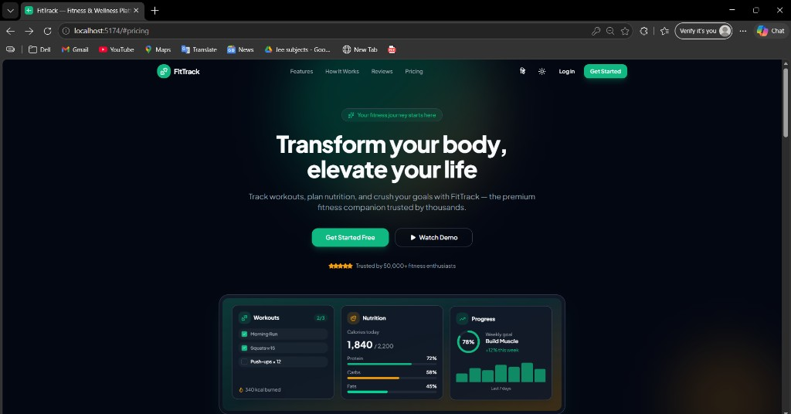

# FitTrack

**A premium fitness & wellness platform** — landing page, 5-step onboarding, and interactive dashboard. Built as the frontend assessment submission for the **Jr Frontend Developer** role at **Wexa AI**.

<p align="center">
  <a href="#live-demo">Live Demo</a> ·
  <a href="#features">Features</a> ·
  <a href="#getting-started">Setup</a> ·
  <a href="#design-decisions">Design</a> ·
  <a href="./COMPONENTS.md">Architecture</a>
</p>

<p align="center">
  
  
  
  
  
</p>

---

## Live Demo

| | Link |
|---|------|
| **Production** | _Add your Vercel/Netlify URL here after deploy_ |
| **Repository** | _Add your GitHub repo URL here_ |

> **Deploy on Vercel:** Import the repo → set **Root Directory** to `fittrack` (if the repo contains a parent folder) → Build: `npm run build` → Output: `dist`. SPA routing is configured in `vercel.json`.

---

## Preview

<p align="center">
  
  <br />
  <em>Landing page — hero section with live product preview (Workouts, Nutrition, Progress)</em>
</p>

<details>
<summary>More screenshots (add images to <code>docs/screenshots/</code>)</summary>

<br />

| Landing (mobile) | Auth flow | Dashboard |
|------------------|-----------|-----------|
|  |  |  |

</details>

---

## About the project

FitTrack is a fictional fitness SaaS product focused on **UI/UX polish**, **responsive design**, and **clean frontend architecture**. The app uses **mock data** and **localStorage** (via Zustand persist) — no backend is required for the assessment.

### What you can try

1. **Landing** — scroll sections, **Watch Demo** video modal, pricing, dark mode, EN/हि language toggle  
2. **Sign up** — 5-step onboarding with validation, Google demo sign-in, confetti on completion  
3. **Dashboard** — stats, workouts, log meals, progress charts, settings, mobile bottom nav  

---

## Features

### Landing page

| Section | Highlights |
|---------|------------|
| **Navbar** | Sticky; transparent → solid on scroll; mobile slide-in drawer |
| **Hero** | Animated gradient; **Get Started Free** + **Watch Demo** (video modal); product preview cards with real mock UI |
| **Social proof** | Brand trust strip |
| **Features** | 4 cards with icons and hover effects |
| **How it works** | 3-step flow (Sign up → Set goals → Track progress) |
| **Testimonials** | Review grid with ratings |
| **Pricing** | Free / Pro / Elite — **Popular** badge on Pro |
| **CTA** | Email capture on gradient background |
| **Footer** | Links, social icons, newsletter |

### 5-step onboarding (`/auth`)

| Step | Details |
|------|---------|
| 1 | Full name, email, password strength bar, confirm password, **Sign up with Google** (account picker) |
| 2 | Date of birth, gender pills, height/weight sliders, kg/lbs toggle |
| 3 | Select 1–3 fitness goals (visual cards + checkmarks) |
| 4 | Activity level (radio cards); **Skip for now** |
| 5 | Avatar upload (drag & drop), username, bio, notification toggles → **Welcome + confetti** |

- Progress bar: **Step X of 5** with animated fill  
- Slide transitions between steps (Framer Motion)  
- Real-time validation (React Hook Form + Zod); Continue disabled until valid  

### Dashboard (`/dashboard`)

| Route | Content |
|-------|---------|
| `/dashboard` | Stats row, quick actions, today’s workout, weekly activity chart |
| `/dashboard/workouts` | Workout plans, start/end session |
| `/dashboard/nutrition` | Log meals form + daily calorie list |
| `/dashboard/progress` | Goal progress bars, chart, milestones |
| `/dashboard/settings` | Profile, notifications, theme, language, log out |

- **Desktop:** sidebar navigation  
- **Mobile:** bottom tab bar  

### Bonus features

- Dark / light theme (persisted)  
- Scroll-triggered section animations (`useInView`)  
- **i18n:** English + Hindi  

---

## Tech stack

| Layer | Tools |
|-------|--------|
| **Core** | React 19, TypeScript, Vite 8 |
| **Styling** | Tailwind CSS v4, CSS variables, Plus Jakarta Sans |
| **UI** | Shadcn-style components (Radix UI primitives, CVA) |
| **Animation** | Framer Motion, canvas-confetti |
| **Forms** | React Hook Form, Zod, `@hookform/resolvers` |
| **Routing** | React Router v7 |
| **State** | Zustand + persist (auth, theme) |
| **Charts** | Recharts |
| **Icons** | Lucide React |
| **i18n** | i18next, react-i18next |

---

## Getting started

### Prerequisites

- **Node.js** 20 or later  
- **npm** 10 or later  

### Install & run

```bash
# Clone your repository
git clone <your-repo-url>
cd fittrack   # use "cd fittrack" if the repo root contains a fittrack/ folder

npm install
npm run dev
```

Open **http://localhost:5173** (or the port Vite prints in the terminal).

### Other scripts

| Command | Description |
|---------|-------------|
| `npm run dev` | Start development server |
| `npm run build` | Type-check + production build → `dist/` |
| `npm run preview` | Preview production build locally |
| `npm run lint` | Run ESLint |

---

## Project structure

```
fittrack/
├── public/                 # Static assets, favicon
├── docs/screenshots/       # README images (see docs/screenshots/README.md)
├── src/
│   ├── components/
│   │   ├── ui/             # Button, Card, Input, Dialog, etc.
│   │   ├── landing/        # Navbar, Hero, Pricing, Footer…
│   │   ├── auth/           # Onboarding steps, Google sign-in
│   │   ├── dashboard/      # Sidebar, stats, charts, workout list
│   │   └── shared/         # Theme, i18n, scroll reveal, auth guard
│   ├── pages/
│   │   ├── LandingPage.tsx
│   │   ├── AuthPage.tsx
│   │   └── dashboard/      # Home, Workouts, Nutrition, Progress, Settings
│   ├── store/              # authStore, themeStore, onboardingStore
│   ├── i18n/locales/       # en.json, hi.json
│   └── lib/                # schemas (Zod), utils, constants
├── COMPONENTS.md           # Component architecture notes
├── vercel.json             # SPA rewrites for deployment
└── README.md
```

Detailed patterns and extension points → **[COMPONENTS.md](./COMPONENTS.md)**

---

## Design decisions

| Topic | Choice | Rationale |
|-------|--------|-----------|
| **Typography** | Plus Jakarta Sans | Modern SaaS feel, strong hierarchy |
| **Color** | Emerald primary + amber accent | Energy, health, and trust without cliché “gym red” |
| **Layout** | Mobile-first, `sm` / `md` / `lg` breakpoints | Assessment requires 375px / 768px / 1440px+ |
| **Motion** | Subtle scroll + step transitions | Polish without distracting motion |
| **Data** | Zustand + `localStorage` | Meets “mock data OK” requirement; easy to swap for API later |
| **Google auth** | Demo account picker | No OAuth keys needed; realistic UX for reviewers |
| **Accessibility** | Focus rings, `aria-label`s, inline errors, semantic forms | Supports a11y scoring criteria |

---

## Assessment checklist

| Requirement | Status |
|-------------|--------|
| Landing page (all sections, responsive, animations) | Done |
| 5-step auth flow (progress, validation, mobile-friendly) | Done |
| Component architecture & reusable UI | Done |
| Dashboard with mock data | Done |
| React + Vite + Tailwind + Shadcn-style UI | Done |
| Framer Motion + form validation (RHF + Zod) | Done |
| i18n (English + second language) | Done (Hindi) |
| Dark mode | Done |
| Component documentation | [COMPONENTS.md](./COMPONENTS.md) |
| Public GitHub repo | Done (add live URL above) |
| Live deploy (Vercel/Netlify) | Pending — add link above |
| Screenshots in README | Add PNGs to `docs/screenshots/` |

---

## Deployment

### Vercel (recommended)

1. Push to GitHub (public repository).  
2. [vercel.com](https://vercel.com) → **Add New Project** → import repo.  
3. If the app is in a subfolder: **Root Directory** = `fittrack`.  
4. **Build Command:** `npm run build` · **Output Directory:** `dist`  
5. Deploy and paste the URL into the [Live Demo](#live-demo) section above.

### Netlify

- Build command: `npm run build`  
- Publish directory: `dist`  
- Add a `_redirects` or `netlify.toml` SPA rule: `/* /index.html 200`

---

## Author

**Priyanshu Raj**  
Jr Frontend Developer Assessment — **Wexa AI**

---

<p align="center">
  <sub>Built with care for pixel-perfect UI, smooth interactions, and maintainable code.</sub>
</p>
